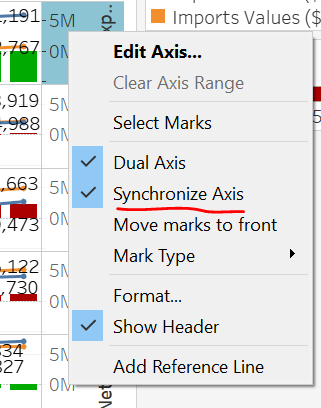
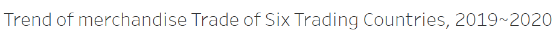

```{r setup, include=FALSE}
knitr::opts_chunk$set(echo = FALSE)
```

# 1. Original visualization Evaluation

### 1.1 Clarity

 1.   There is duplication of each chart. [Area chart](https://en.wikipedia.org/wiki/Area_chart) usually used to show a response to summarized by categories and used to represent cumulated totals using numbers or percentages (stacked area charts in this case) over time. For the chart, there is duplication of import and export which is difficult to see the trend.  

 2.   Time period of each country are not clear enough, Japan only has 2020 while others have 2019~2021.

 3.   The Y-axis of each country is not the same, as such, the difference in scale is not conveyed properly. It is hard to compare the different import and export trade across different country or even within the same country.

### 1.2 Aesthetics

 1.	  It is not necessary to use two Y-axes to represent export and import. It will confuse readers. In addition, there is no marker to identify which country’s currency is used to measure the exports and imports.  

 2.   The title of the graph shows these six countries are the top trade countries. The subtitles of the graphs do not convey the intent of the graphs well. In this case, the graph is trying to show the change in merchandise trade of six country during 2019 and 2020, and the subtitles “Month of Period” mention that the graphs are using the monthly data while the X-axis only show yearly marker. Hence, the subtitles are not clear. 

 3.	  There is poor use of colors in the chart. The fill color is not particularly useful as it does not seem to serve any purpose, especially for some charts which have lots of duplication.

# 2. Proposed Design

### 2.1 Sketch
The proposed design is as follow.


### 2.2 Advantages of proposed design

 1.   More clear title and subtitle are used to explain key words and definitions in the graph.
 
 2.   Y-axis are changed to same unit of measurement to enable the reader to read and compare imports value, exports value and net exports value across different month more easily.

 3.   New measure value: net export value is used to show the merchandise trade of each country clearly.

 4.   Add a bar chart to show net value, color (green and red) is used to bring attention negative or positive net exports value. 

 5.	  Annotations are used to emphasize key observations.  Within the annotations, ranking of net exports value is added to show the rank each month between countries.

# 3. Data visualization steps

### 3.1 Data preparation

 1.   Check “Clean with Data Interpreter” to automatically identify the form.
 
 
 2.   Select useless months (months between 1976 ~ 2018 and after 2021) and hide.
 
 
 3.   Use Tableau to pivot the data in sheet, with measure values in columns and variables (countries) in rows.
  
 
 4.   View the data in Tableau.
 {width=80%}
 
 5.   Export the data.
 
  {width=80%}
 
 6.   Repeat steps 1 – 6 for exports. Merge the exported files using Microsoft Excel and select observations from six countries.
 
 7.   Import the cleaned dataset into Tableau.
 

### 3.2 Data visualization

 1.   Add “Month” to Columns tab and “Country”, “Measure Values” and “Net Export” to Rows tab.
 
 {width=90%}
 
 2.   Remove other measure values only keep imports and exports.
 {length=80%}
 
 3.   Right click on the bottom Y-axis and select dual axis chart to make import values and export values show in the same view.
 
 {width=40%}
 
 4.   Right click on the right Y-axis, select Synchronize Axis and deselect Show Header to let the Y-axis of each country under the same measurement.
 
 {width=40%}
 
 5.   Drag Net Exports to Color tab and change panel from Automatic to Bar.
 
 
 6.   Rename the title and the measure names.
 
 
 
 7.   Show the value of each country's imports and exports in January 2019 and December 2020 to let readers see the change easily.
 {width=80%}
 
 8.   Right click the Net Export tab on the right and click edit colors. Set stepped color in 2 and choose 2 colors. For red, it means represent imports is greater than exports and green represent the opposite situation.
 
 {width=40%}
 {width=40%}
 
 9.   Create three Calculated Fields.
 {width=80%}
 
 {width=80%}
 
 {width=80%}
 
 10.  Drag three Calculated Fields into Tooltip and edit Tooltip.
 {width=80%}
 
 11.  Create a new dashboard and drag the Sheet 1 from left to the right.
 {width=40%}
 
 {width=40%}
 
# 4. Final visualization

### 4.1 Snapshot of dashboard


### 4.2 Main observations

 1.   Overall, export is trending upwards across all countries/regions except Japan between 2019 and 2020. For import, three countries/regions (Hong Kong, Tai Wan and Malaysia) increase while other three (Mainland China, The U.S. and Japan) decrease.
 
 2.   For net exports value, there was negative as well as positive in Japan, Malaysia, the U.S. and Mainland China while Hong Kong only had negative values and Tai Wan only had positive values. 
 
 3.   For the countries which had both negative and positive net exports value, most of the consecutive negative net exports had been since April 2020. This may be potentially because of COVID-19.


