```{r setup, include=FALSE}
knitr::opts_chunk$set(echo = FALSE)
```

# 1. Original visualization Evaluation

### 1.1 Clarity

1.   Top net exporter/importer is the trading partner with largest net export/import value. In this case, both x-axis and y-axis are showing the export and import values, so for the reader who know little about economics, they may confuse that why Hong Kong instead of Mainland China which partner had the largest export value, was the top net exporter.  

2.   The centre point (white circle) is an important indicator because according to this point, readers can recognize the relation between import and export value. In this case, some bubbles overlay each other so that it is inconvenient to compare the size of the import and export values by seeing the position of white circle. 

3.   Unclear net importers/exporters label. This visualisation doesn’t clarify that whether white point or bubble falls into the “Net importers/exporters” section means that the trading partner is “Net importers/exporters”. 

 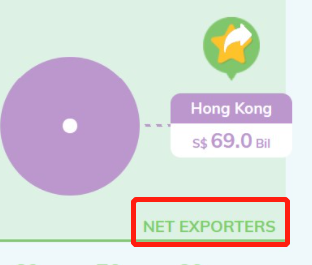{width=40%}

### 1.2 Aesthetics

 1.	  Unnecessary note since the visualization do not show any information about it, and the dashboard header is missing.  
 
 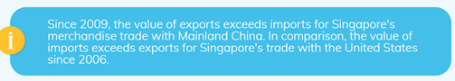{width=50%}

 2.   Tooltips are confusing. The reader cannot directly understand what these values represent and there is not clarification in note. 
 
 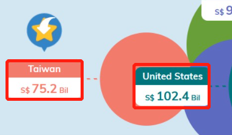{width=40%}

 3.	  Improper formatting of both x-axis and y-axis. The units comprising SGD were missing
 
# 2. Proposed Design

### 2.1 Sketch
The proposed design is as follow.

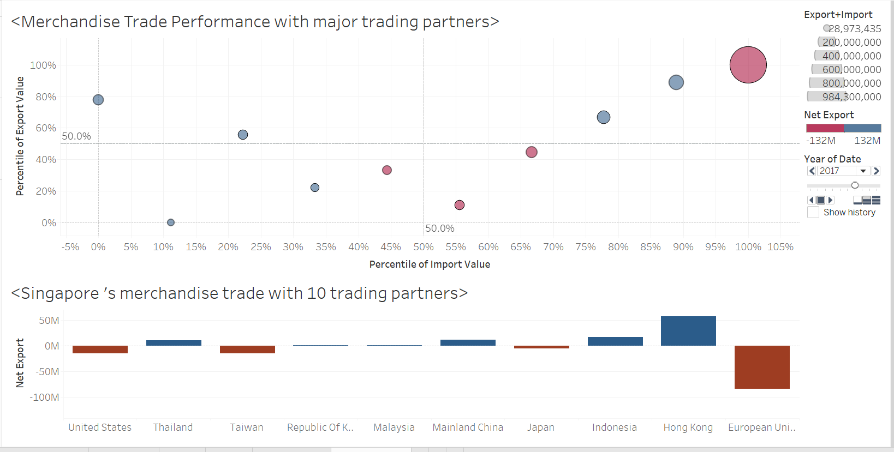

### 2.2 Advantages of proposed design

 1.   Use blue and red to show the net importer and net exporter which is easily recognized.
 
 2.   Use percentile instead of actual value because EU has larger export/import values than any other trading partners.

 3.   An Net Export chart will be created, to see the difference in values which perhaps the earlier visualization didn't show.

 4.	  Animation are used to emotionally engaging, engendering increased interest or enjoyment, and facilitates object constancy for changing objects.
 
 
# 3. Data visualization steps

The raw data is in .xlsx format.

It contains 2 sheets:

* T1: Merchandise Imports by Region/Market, Monthly
* T2: Merchandise Exports by Region/Market, Monthly

Things to Note:

* Data starts at row 6
* Trading partners and date need to be filtered out
* Data needs to be transposed

### 3.1 Data preparation

 1.   First, launch the Tableau Desktop software.
 
 2.   Import the Data.
 
 3.   As discussed previously, since the data only begins at row 6, we will check the Data Interpreter before dragging tables into the workspace.
 
 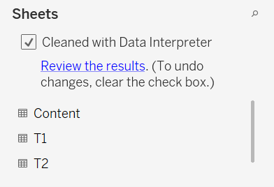{width=40%}

 3.   Drag T1 into the workspace.
 
  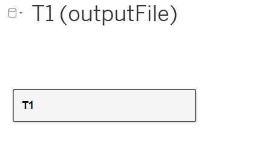{width=40%}

 4.   Since, we only require the 10 trading partners, a filter will be applied.
The sequence steps are highlighted in the following:

Click on the Add|Filter button and then Add.

  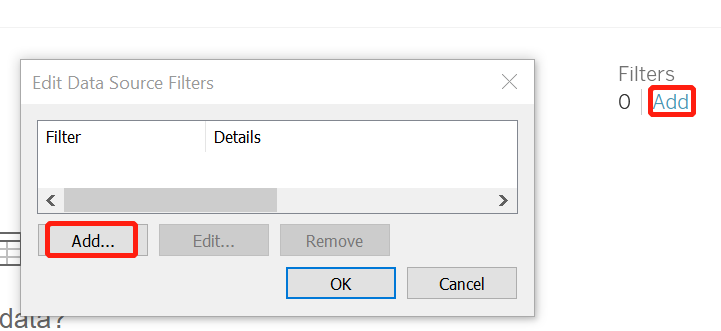{width=40%}

Select Variables and Click OK.

  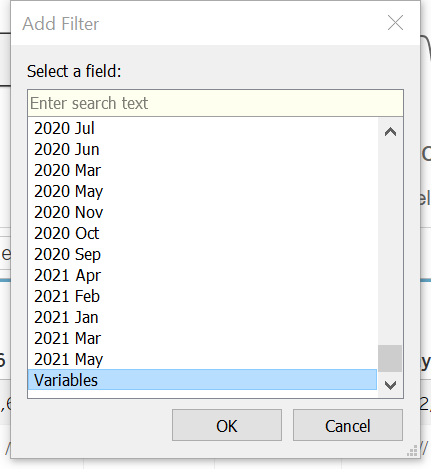{width=40%}

Select all the 10 trading partners (Mainland China, Malaysia, Hong Kong, Taiwan, United States, Japan, EU, Indonesia, Republic of Korea and Thailand). 

  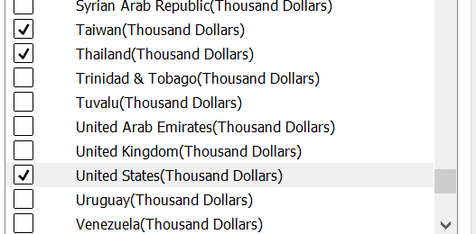{width=40%}

We will see the filter added as shown below. Register the changes by clicking OK.

  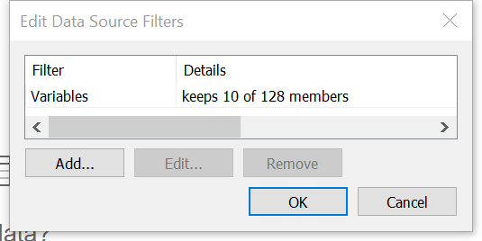{width=40%}

 4.   Pivot the table.Select all columns and click the black triangle of the last column on the right

 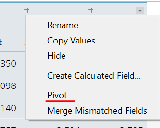{width=40%}

 
 5.   Rename columns
 
Select the Abc icon and right click and select Date to change the format of the column.

  {width=40%}

Right click on the column one-by-one and select Rename. Rename the respective columns to Date, Import Value and Name of trading partner

  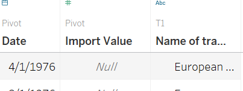{width=40%}

 6.   Since we require years from 2011 to 2020, we will add another filter.

The steps are shown below:

  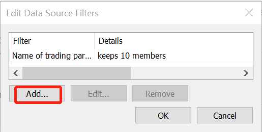{width=40%}

  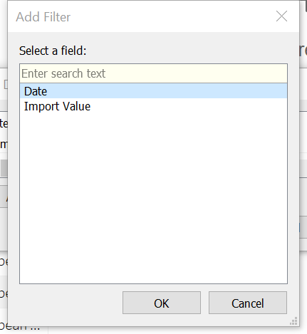{width=40%}

  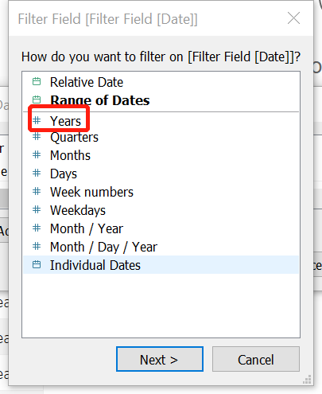{width=40%}

  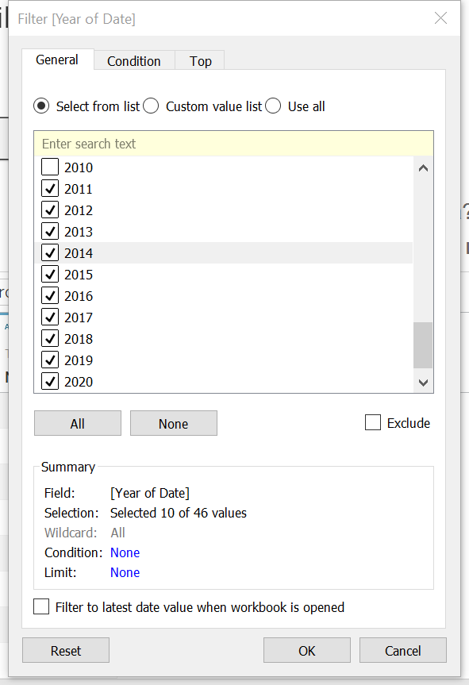{width=40%}

 7.   Save the file as Import.csv
 
  {width=40%}

 8.   Repeat the steps 2~7 for T2 and export the data as Export.csv

 9.   Open a new session of Tableau and drag the newly created Import.csv.

Drag the Import.csv node into the workspace.

  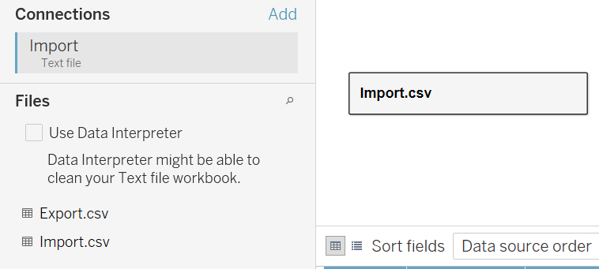{width=40%}

 10.  Now, we will merge the two .csv files on Date & Name of trading partner. Double click on Import.csv in the workspace and then drag Export.csv in.

Next, click on the Venn Diagram icon add Date.

  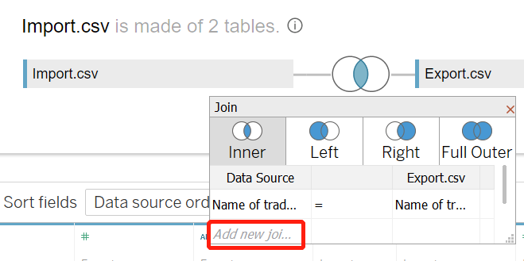{width=40%}

Then, we hide the two duplicate columns

Right click and select Hide

  {width=40%}

 11.  Create aliases for trading partner data
 
Right click on the Name of trading partner column and select Aliases.

For each of the partner, edit the name and click ok.

  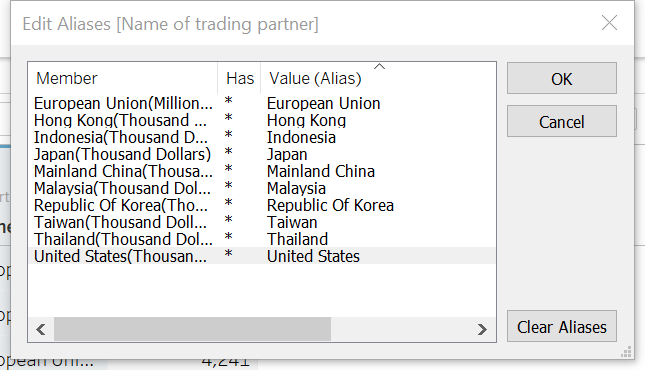{width=40%}

 12.  Since for EU unit of measurement is Million dollar, we need to calculate the import/export value.
 
  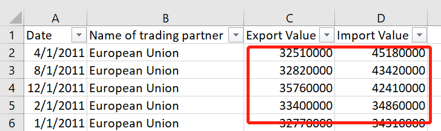{width=40%}

### 3.2 Data visualization

 1.   For the main chart, drag 'Import Value' to 'Rows' and 'Export Value' to 'Columns shelves.
 
  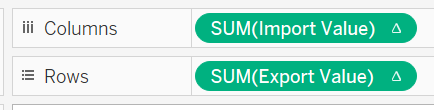{width=40%}
 
 2.   As EU has larger export/import than any other trading partners, we will change use percentile instead of actual value in this chart.
 
Click the triangle --> Quick Table Calculation --> Percentile
 
  {width=40%}

Click the triangle again --> Compute Using --> Name of trading partner

  {width=40%}

 2.   Create a new Calculated Field to show the transaction amount

  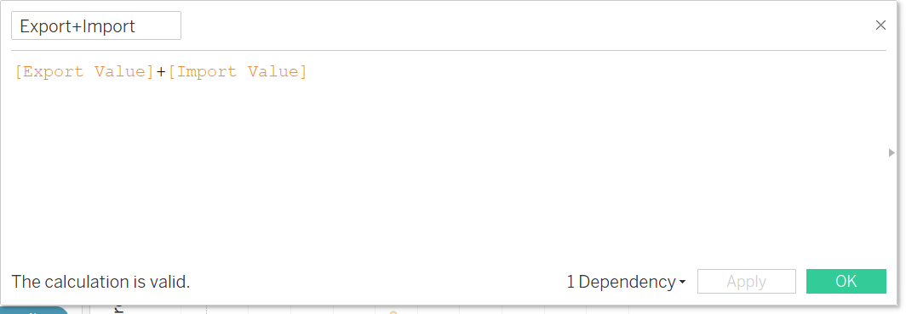{width=40%}

 3.   Drag 'Export-Import' into Color, so the color will show whether a trading partner is a Net Importer or a Net Exporter. Drag 'Export+Import' into Size.
 
  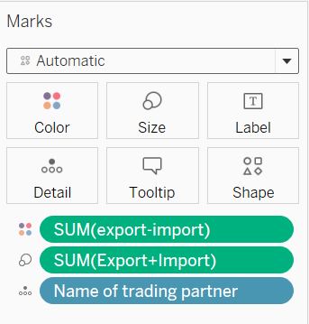{width=40%}
 
 4.   Color setting & Reference line

  {width=40%}

  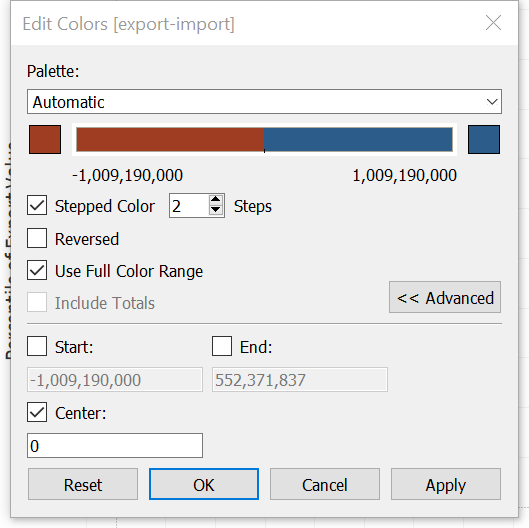{width=40%}

Add the reference line both for y-axis and x-axis
 
  {width=40%}

  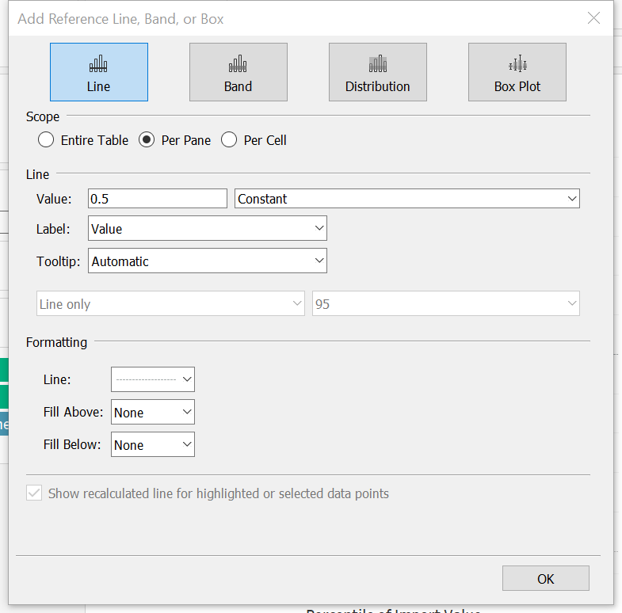{width=40%}

 5.   Drag 'Date' into Pages, select Year.
 
  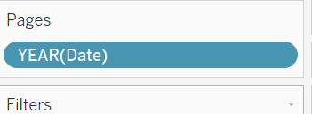{width=40%}

 6. Add two calculated field and drag them into tooltip.
 
  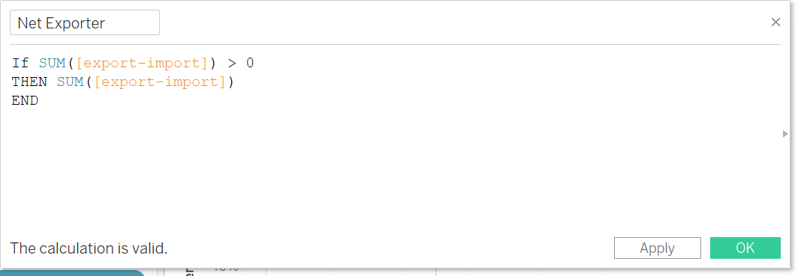{width=40%}

  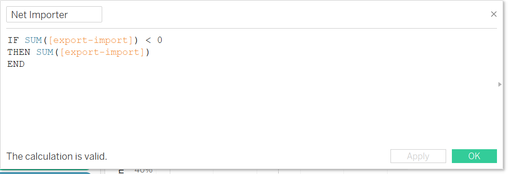{width=40%}

  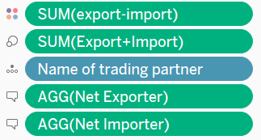{width=40%}

Click Tooltip and edit it.

  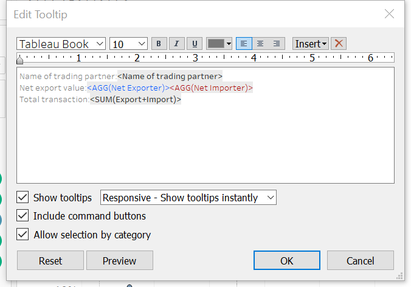{width=40%}

 7.   For chart 2, create a new worksheet and name it “Yearly Trade’. Drag ‘Name of trading partner’ and ‘Date’ to ‘Columns’ and ‘Export Value’ to ‘Rows’ shelves. Sort ‘Name of trading partner’ by descending sum of ‘Export Value’. Since EU has a large export/import value, we would build a chart (chart3) for it separately.
 
  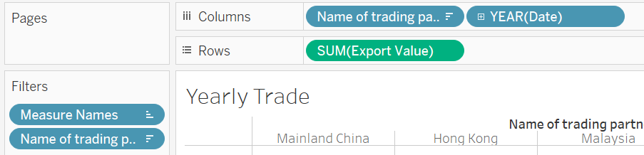{width=40%}

  {width=40%}

 8.   Create a new calculated field: 'Export-Import'.
 
  {width=40%}

 9.   Adding Export-Import
Drag and drop Export-Import twice on to the Rows bar.

  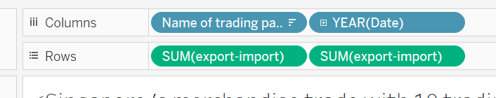{width=40%}

Next, we will click on the lower y-axis and select Dual Axis and Synchronize Axis.

  {width=40%}

  {width=40%}
Now, we will change the chart into a bar chart. Under the Marks card, select SUM(Export-Import) and select from the drop down, Bar. Then drag the Export-Import variable into the Color box and reduce the opacity.

  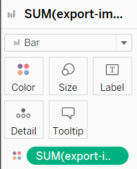{width=40%}

 10.   Changing the color, adjust the setting like below:
 
  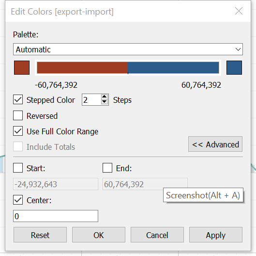{width=40%}

 11.   Create a dashboard, drag above two charts into it.
 
Then add Animation function.

  {width=40%}

  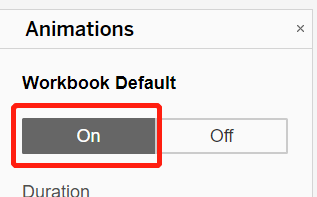{width=40%}

Then synchronize the animation.

  {width=40%}

### 4.2 Main observations

 1.   EU was always the largest net importer from 2011-2020, but it's net export increase rapidly in 2020 which means import from EU had decreased that time. This coincided with the COVID-19 happened. 
 
 2.   Taiwan and EU were the major net importer of Singapore because from 2011 to 2020 the import value was always larger than the export value.   
 
 3.   Overall, Singapore is trying to produce own products and export to other countries since more trading partner are becoming net exporters. 